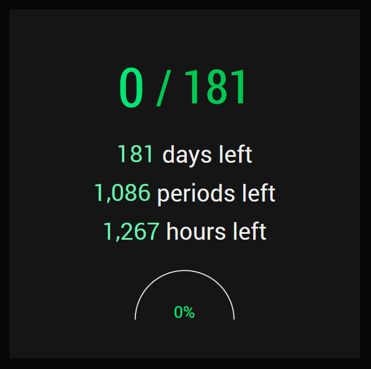

# Total School Days (v11.0)

## Update v11.0

- Now includes a sleek new design and progress bar!
- Utilizes the Bootstrap framework using the Cyborg Bootstrap template by Bootswatch (https://bootswatch.com/cyborg)

## What is it?

A manually-updated website/API that displays the number of current school days for RHS and other US high schools.

It includes API documentation and a getting started toolkit for developers.

The count is updated daily with a trigger/profile on Tasker (an app for Android).

## [API Documentation for Developers](https://github.com/siliconninja/TotalSchoolDays/tree/master/wiki/API-Documentation.md)
See the [API Documentation section](https://github.com/siliconninja/TotalSchoolDays/tree/master/wiki/API-Documentation.md) of the Wiki for instructions on how to:
- use this API in your own projects
- set up your own version of Total School Days for your school

## Screenshot

## License

[MIT License](LICENSE)

In addition, please credit the following libraries if you decide to use my website as-is. If you remove a library or use your own instead, credit for whatever you remove is not needed:
- Progressbar.js (https://kimmobrunfeldt.github.io/progressbar.js/), MIT license
- Odometer (https://github.com/HubSpot/odometer), MIT license
- Cyborg Bootstrap theme from Bootswatch (https://bootswatch.com/cyborg/), MIT license
