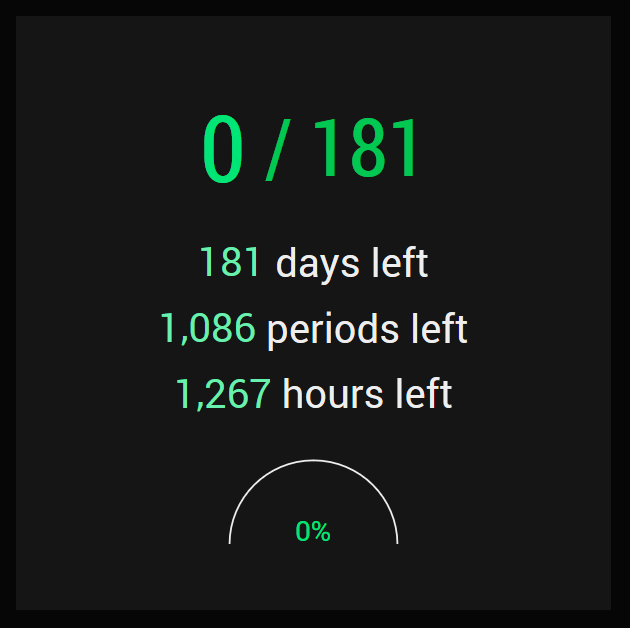

# Total School Day Count Website (v11.0)

- **Now includes a sleek new design and progress bar!**

## What is it?

A manually-updated website/API that displays the number of current school days for RHS and other US high schools.

The count is updated daily with a trigger/profile on Tasker (an app for Android).

## Screenshot

## License

&copy; 2017-present siliconninja. All rights reserved.
